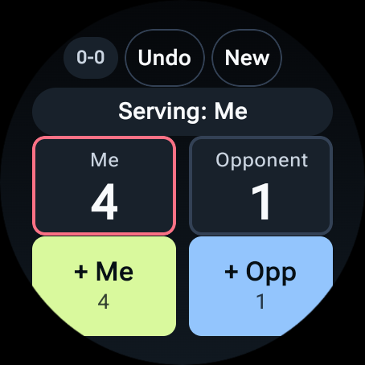

# TT-Score Google Watch 3

Wear OS table-tennis scoring app for fast point tracking during real matches.




## Functionality

- Match format: best of 3 sets.
- Set rules: first to 11 points, win by 2 points.
- Serve rules:
  - service changes every 2 points before deuce
  - at 10-10 and above, service changes every point
- At the start of each set, the app asks who serves first.
- Main scoring screen shows:
  - current points (`Me` vs `Opponent`)
  - current server
  - set score (`0-0`, `1-0`, etc.)
- Quick controls:
  - `+ Me`
  - `+ Opp`
  - `Undo`
  - `New` (reset match during play)
- Keeps the watch display on while the app is in the foreground.

## Requirements

- Android Studio (latest stable recommended).
- Android SDK with:
  - `platform-tools` (ADB)
  - Wear OS emulator image (if testing in emulator)
- Java 17 runtime (Android Studio bundled JBR works).
- For physical watch install:
  - Google Pixel Watch 3
  - Developer options enabled on watch
  - ADB debugging enabled
  - Wireless debugging enabled
  - Watch and computer on the same Wi-Fi network

## Install And Run (Step By Step)

### 1) Get the project

```bash
git clone https://github.com/uwesterr/TT-Score_Google_Watch_3.git
cd TT-Score_Google_Watch_3/wear-table-tennis
```

### 2) Open in Android Studio

1. Open Android Studio.
2. Select `Open`.
3. Choose the `wear-table-tennis` folder.
4. Wait for Gradle sync to finish.

### 3) Run on Wear emulator

1. Android Studio -> `Tools` -> `Device Manager`.
2. Create/start a `Wear OS Large Round` virtual device.
3. Select the emulator in the run target dropdown.
4. Run the `app` configuration.

### 4) Run on a real Pixel Watch 3 (wireless ADB)

On watch:

1. `Settings` -> `System` -> `About` -> `Versions`.
2. Tap `Build number` 7 times (enable Developer options).
3. Go to `Settings` -> `Developer options`.
4. Enable `ADB debugging`.
5. Enable `Wireless debugging`.
6. Open `Pair new device` and note pairing code.

On computer (Terminal):

```bash
ADB="/Users/uwesterr/Library/Android/sdk/platform-tools/adb"
$ADB mdns services
```

Use the current `_adb-tls-pairing._tcp` IP:port from that output:

```bash
$ADB pair <PAIRING_IP:PAIRING_PORT>
```

Enter the 6-digit code shown on watch.

Then connect using the `_adb-tls-connect._tcp` IP:port:

```bash
$ADB connect <CONNECT_IP:CONNECT_PORT>
$ADB devices
```

Install app:

```bash
env JAVA_HOME="/Applications/Android Studio.app/Contents/jbr/Contents/Home" \
ANDROID_SERIAL="<CONNECT_IP:CONNECT_PORT>" \
./gradlew :app:installDebug
```

Launch app:

```bash
$ADB -s <CONNECT_IP:CONNECT_PORT> shell am start -n com.uwe.tabletennisscore/.MainActivity
```

## Build And Test

From `wear-table-tennis`:

```bash
env JAVA_HOME="/Applications/Android Studio.app/Contents/jbr/Contents/Home" ./gradlew test
env JAVA_HOME="/Applications/Android Studio.app/Contents/jbr/Contents/Home" ./gradlew :app:assembleDebug
```
