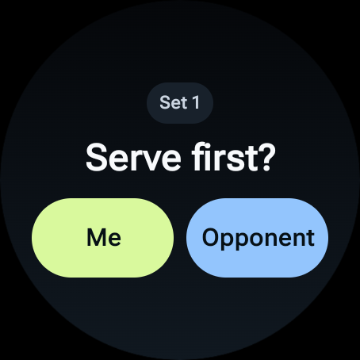
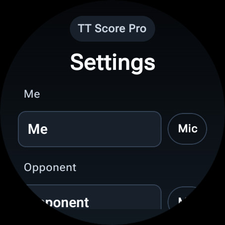
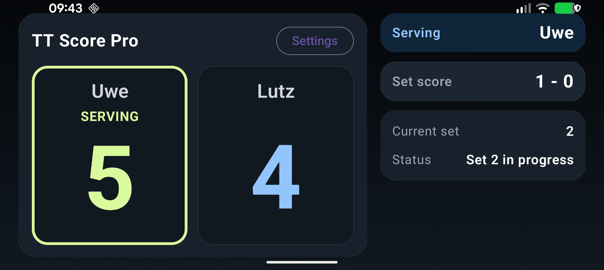
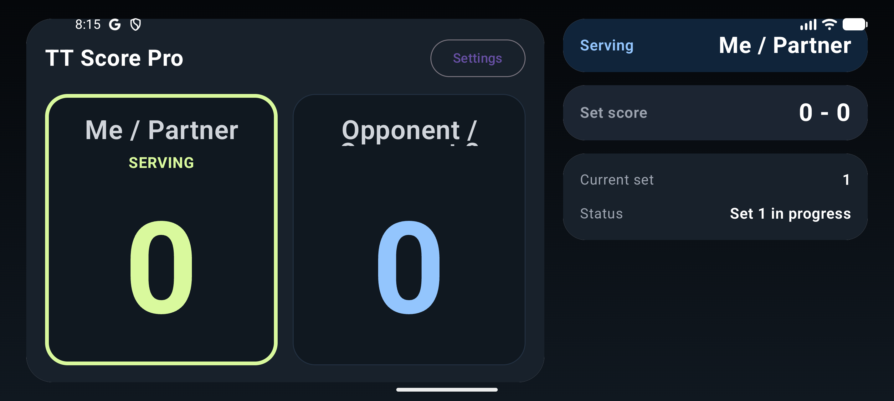

# TT Score Pro

TT Score Pro is a **standalone Wear OS table-tennis scoring app** with an optional **Android phone companion** that mirrors the live match.
Singles is the default mode. Doubles is available with rule-aware serving and receiving order.

The project was written with **Codex**.

## Screenshots

### Watch





### Phone Companion




## Current UI

### Watch app

- Standalone scoring on the watch for real matches
- `Singles` default, `Doubles` optional
- `Best of 3` default, optional `Best of 5`
- Large touch controls for:
  - `+ Me`
  - `+ Opp`
  - `Undo`
  - `New`
- Live match display shows:
  - score
  - set score
  - current server in singles
  - `Server` and `Receiver` in doubles
- Doubles opening flow on the watch:
  - who serves first
  - first server
  - first receiver
- Watch settings include:
  - match mode
  - all player names
  - speech input for names
  - match format
  - haptics
  - sounds
  - always-on display
  - privacy policy
- In-match cues include:
  - serve change
  - deuce
  - set point
  - match point
  - end change
  - deciding-set doubles receiver swap at `5`
- Swipeable point-history charts are available during and after sets

### Phone companion app

- Read-only live companion for the watch match
- `Standard` view and dedicated `Scoreboard` view
- Landscape scoreboard is tuned for distance readability
- Phone display shows:
  - score
  - set score
  - current set
  - match status
  - current server in singles
  - `Server` and `Receiver` in doubles
- End-of-set and end-of-match cards
- Optional phone speech announcements in `German` or `English`
- Separate phone settings for:
  - `Jingles`
  - `Speech`
  - `Language`
  - privacy policy

## Serving Rules

### Singles

- Choose the first server in set 1.
- Service changes every `2` points.
- From `10-10`, service changes every point.
- The opening server alternates from set to set.

### Doubles

- At the start of each set, choose:
  - which pair serves first
  - the first server
  - the first receiver
- Service changes every `2` points, then every point from `10-10`.
- On each service change:
  - the previous receiver becomes the next server
  - the partner of the previous server becomes the next receiver
- In the deciding set, when one side first reaches `5`:
  - ends change
  - the pair due to receive next swaps receiver order

## Devices And Requirements

- Android Studio (latest stable recommended)
- Java 17 runtime (Android Studio bundled JBR is fine)
- Android SDK with `platform-tools`
- For watch testing:
  - Wear OS emulator image, or
  - physical Wear OS watch

### Confirmed watch targets

- Google Pixel Watch 3
- Samsung Galaxy Watch7 44mm (`SM-L310`)

### Important behavior

- The **watch app stays usable without the phone nearby**
- The **phone app is only a companion display**

## Project Structure

- `wear-table-tennis/app` = Wear OS watch app
- `wear-table-tennis/phone` = Android phone companion app

## Play Store Packaging

- Both apps share the Play package name `com.uwe.tabletennisscore`.
- The phone companion and the watch app are published under **one Play listing**, but on **separate release tracks**:
  - `phone-release.aab` for the normal Android track
  - `app-release.aab` for the dedicated **Wear OS** track
- The watch app is the primary standalone product.
- The phone app remains optional and acts as a companion scoreboard.

## Android Studio Workflow Notes

### Module-to-device mapping

- `:app` is the Wear OS scorer
- `:phone` is the Android phone companion
- Install `:app` on the watch or Wear emulator
- Install `:phone` on the phone or phone emulator

The watch app remains standalone and still works without the phone nearby.

### Running in Android Studio

1. Start the Wear emulator from `Tools` -> `Device Manager` and run the `app` configuration.
2. Start the phone emulator and run the `phone` configuration.
3. Treat the phone app as a companion viewer only; the watch app remains the scoring source of truth.

### Pairing phone and watch emulators

1. Use Android Studio's Wear pairing flow first.
2. If auto-pairing fails, open or install the **Wear OS** app on the phone emulator and finish the pairing there.
3. After pairing, reopen both TT Score Pro apps and trigger a fresh score update on the watch so the phone receives the first mirrored state.

### Installing on real devices

- Watch:
  - enable developer options
  - enable `ADB debugging`
  - enable `Wireless debugging`
  - pair/connect with `adb`
  - install `:app`
- Phone:
  - enable developer options
  - enable `USB debugging` or `Wireless debugging`
  - install `:phone`

### Common pitfalls

- If `:phone` is installed on the watch by mistake, the watch shows the companion waiting screen instead of the scorer.
- The phone app can stay in a waiting state until the watch sends a fresh score event after pairing.
- Pairing the emulators is separate from launching the correct module on each device.

## Install And Run

### 1) Get the project

```bash
git clone https://github.com/uwesterr/TT-Score_Google_Watch_3.git
cd TT-Score_Google_Watch_3/wear-table-tennis
```

### 2) Open in Android Studio

1. Open Android Studio.
2. Choose `Open`.
3. Select the `wear-table-tennis` folder.
4. Wait for Gradle sync to finish.

### 3) Run on emulators

#### Watch emulator

1. Open `Tools` -> `Device Manager`.
2. Create or start a `Wear OS Large Round` emulator.
3. Select the watch emulator in the device dropdown.
4. Run the `app` configuration.

#### Phone emulator

1. Create or start an Android phone emulator.
2. Select it in the device dropdown.
3. Run the `phone` configuration.

To mirror the watch score on the phone emulator, pair the phone and watch emulators through the normal Wear OS emulator pairing flow.

### 4) Install on a real watch

#### Pixel Watch 3

On the watch:

1. Open `Settings` -> `System` -> `About` -> `Versions`.
2. Tap `Build number` 7 times.
3. Go back to `Settings` -> `Developer options`.
4. Turn on `ADB debugging`.
5. Turn on `Wireless debugging`.
6. Tap `Pair new device` and keep that screen open.

#### Samsung Galaxy Watch7 44mm (`SM-L310`)

On the watch:

1. Open `Settings` -> `Connections` -> `Wi-Fi`.
2. Connect the watch to the same Wi-Fi network as the computer.
3. Go to `Settings` -> `About watch` -> `Software`.
4. Tap `Software version` 5 times.
5. Go to `Settings` -> `Developer options`.
6. Turn on `ADB debugging`.
7. Turn on `Wireless debugging` or `Debug over Wi-Fi`.
8. Tap `Pair new device` and keep that screen open.

#### Pair and install from the Mac

```bash
cd /Users/uwesterr/Documents/New\ project/wear-table-tennis
ADB="/Users/uwesterr/Library/Android/sdk/platform-tools/adb"
$ADB mdns services
$ADB pair <PAIRING_IP:PAIRING_PORT>
$ADB connect <CONNECT_IP:CONNECT_PORT>
$ADB devices
env JAVA_HOME="/Applications/Android Studio.app/Contents/jbr/Contents/Home" \
ANDROID_SERIAL="<CONNECT_IP:CONNECT_PORT>" \
./gradlew :app:installDebug
$ADB -s <CONNECT_IP:CONNECT_PORT> shell am start -n com.uwe.tabletennisscore/.MainActivity
```

Expected result:

- the watch opens on the scorer
- the watch app works even without the phone companion connected

### 5) Install on a real Android phone

Enable developer mode on the phone:

1. Open `Settings` -> `About phone`.
2. Tap `Build number` 7 times.
3. Go to `Settings` -> `System` -> `Developer options`.
4. Enable either:
   - `USB debugging`, or
   - `Wireless debugging`

Install the companion app:

```bash
cd /Users/uwesterr/Documents/New\ project/wear-table-tennis
env JAVA_HOME="/Applications/Android Studio.app/Contents/jbr/Contents/Home" \
ANDROID_SERIAL="<PHONE_SERIAL>" \
./gradlew :phone:installDebug
/Users/uwesterr/Library/Android/sdk/platform-tools/adb -s <PHONE_SERIAL> \
shell am start -n com.uwe.tabletennisscore/com.uwe.tabletennisscore.phone.MainActivity
```

Expected result:

- the phone opens the companion app
- the phone mirrors the live watch score when the watch app is running and paired

## Manual Smoke Test

### Watch

1. Start a match.
2. Choose the first server.
3. Score points for both players.
4. Confirm serve changes correctly.
5. Confirm deuce behavior at `10-10`.
6. Finish a set and confirm the next set starts with the opposite starting server.
7. Test `Undo`.
8. Test `New`.
9. Open `Settings`.
10. Test name speech input.
11. Swipe to the history chart screens.

### Phone companion

1. Open the phone app while the watch app is running.
2. Confirm the score mirrors the watch.
3. Rotate the phone to landscape and confirm the large scoreboard is readable from farther away.
4. Confirm the serving player is clearly indicated.
5. Score a point on the watch and listen for the German spoken score.
6. Wait for a serve change and confirm the phone announces who serves next.
7. Finish a set and a match and confirm:
   - result cards appear
   - German winner announcements play
8. Open phone `Settings`, switch `Sounds` off, and confirm all phone audio stops.

## Build And Test

From `wear-table-tennis`:

```bash
env JAVA_HOME="/Applications/Android Studio.app/Contents/jbr/Contents/Home" ./gradlew test
env JAVA_HOME="/Applications/Android Studio.app/Contents/jbr/Contents/Home" ./gradlew assembleDebug
env JAVA_HOME="/Applications/Android Studio.app/Contents/jbr/Contents/Home" ./gradlew bundleRelease
```
