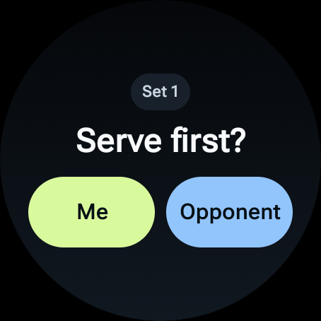
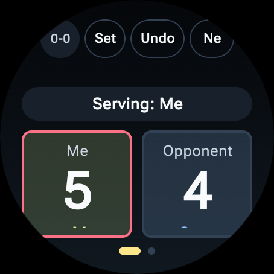
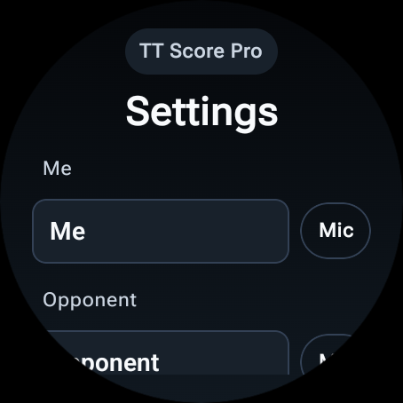
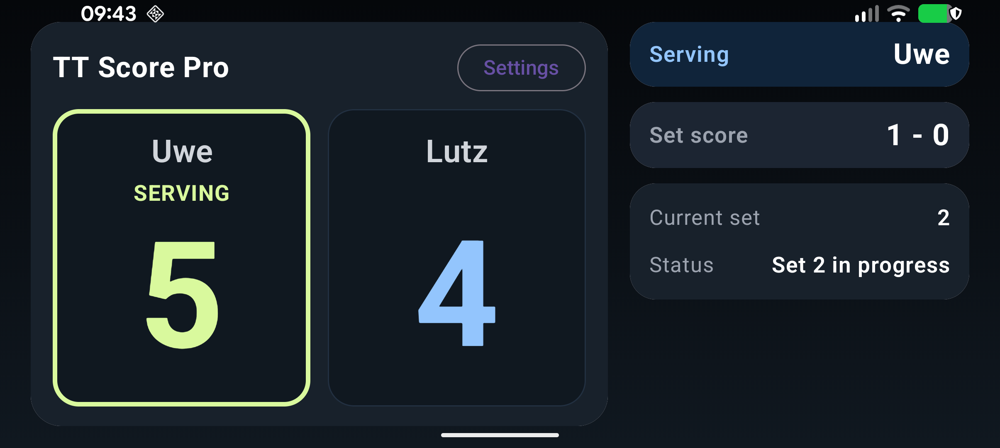

# TT Score Pro

TT Score Pro is a **standalone Wear OS table-tennis scoring app** with an optional **Android phone companion** that mirrors the live match.

The project was written with **Codex**.

## Screenshots

### Watch





### Phone Companion



## What The App Does

### Watch app

- Standalone scoring app for real table-tennis matches
- Best of 3 by default, with optional best of 5
- Sets to 11, win by 2
- Service changes every 2 points before deuce, then every point from `10-10`
- Asks who serves first in set 1
- Later sets automatically alternate the starting server
- Large touch-first controls:
  - `+ Me`
  - `+ Opp`
  - `Undo`
  - `New`
- Live display of:
  - current score
  - current server
  - set score
- Dedicated settings screen with:
  - editable player names
  - speech input for names
  - best-of-3 / best-of-5
  - haptics on/off
  - sounds on/off
  - display always on on/off
- Rule-aware cue banners for:
  - serve change
  - deuce
  - set point
  - match point
  - change ends
- Swipeable point-history charts:
  - during a set
  - after a set
  - after a match
- Win/loss sound cues and celebration effects

### Phone companion app

- Read-only companion display for the live match
- Big scoreboard layout with a landscape mode tuned for distance readability
- Shows:
  - current score
  - current server
  - set score
  - current set
  - match status
- End-of-set and end-of-match result cards
- Phone-side sounds and celebration animation
- Phone-side speech output in **German**
  - after each ball, the phone says the score
  - the score order follows the player who serves next
  - when the serve changes, the phone says who serves next
  - after each set and each match, the phone announces the winner and the set standing
- Phone `Sounds` setting is the master switch for all phone audio:
  - jingles
  - speech

## Devices And Requirements

- Android Studio (latest stable recommended)
- Java 17 runtime (Android Studio bundled JBR is fine)
- Android SDK with `platform-tools`
- For watch testing:
  - Wear OS emulator image, or
  - physical Wear OS watch

### Confirmed watch targets

- Google Pixel Watch 3
- Samsung Galaxy Watch7 44mm (`SM-L310`)

### Important behavior

- The **watch app stays usable without the phone nearby**
- The **phone app is only a companion display**

## Project Structure

- `wear-table-tennis/app` = Wear OS watch app
- `wear-table-tennis/phone` = Android phone companion app

## Install And Run

### 1) Get the project

```bash
git clone https://github.com/uwesterr/TT-Score_Google_Watch_3.git
cd TT-Score_Google_Watch_3/wear-table-tennis
```

### 2) Open in Android Studio

1. Open Android Studio.
2. Choose `Open`.
3. Select the `wear-table-tennis` folder.
4. Wait for Gradle sync to finish.

### 3) Run on emulators

#### Watch emulator

1. Open `Tools` -> `Device Manager`.
2. Create or start a `Wear OS Large Round` emulator.
3. Select the watch emulator in the device dropdown.
4. Run the `app` configuration.

#### Phone emulator

1. Create or start an Android phone emulator.
2. Select it in the device dropdown.
3. Run the `phone` configuration.

To mirror the watch score on the phone emulator, pair the phone and watch emulators through the normal Wear OS emulator pairing flow.

### 4) Install on a real watch

#### Pixel Watch 3

On the watch:

1. Open `Settings` -> `System` -> `About` -> `Versions`.
2. Tap `Build number` 7 times.
3. Go back to `Settings` -> `Developer options`.
4. Turn on `ADB debugging`.
5. Turn on `Wireless debugging`.
6. Tap `Pair new device` and keep that screen open.

#### Samsung Galaxy Watch7 44mm (`SM-L310`)

On the watch:

1. Open `Settings` -> `Connections` -> `Wi-Fi`.
2. Connect the watch to the same Wi-Fi network as the computer.
3. Go to `Settings` -> `About watch` -> `Software`.
4. Tap `Software version` 5 times.
5. Go to `Settings` -> `Developer options`.
6. Turn on `ADB debugging`.
7. Turn on `Wireless debugging` or `Debug over Wi-Fi`.
8. Tap `Pair new device` and keep that screen open.

#### Pair and install from the Mac

```bash
cd /Users/uwesterr/Documents/New\ project/wear-table-tennis
ADB="/Users/uwesterr/Library/Android/sdk/platform-tools/adb"
$ADB mdns services
$ADB pair <PAIRING_IP:PAIRING_PORT>
$ADB connect <CONNECT_IP:CONNECT_PORT>
$ADB devices
env JAVA_HOME="/Applications/Android Studio.app/Contents/jbr/Contents/Home" \
ANDROID_SERIAL="<CONNECT_IP:CONNECT_PORT>" \
./gradlew :app:installDebug
$ADB -s <CONNECT_IP:CONNECT_PORT> shell am start -n com.uwe.tabletennisscore/.MainActivity
```

Expected result:

- the watch opens on the scorer
- the watch app works even without the phone companion connected

### 5) Install on a real Android phone

Enable developer mode on the phone:

1. Open `Settings` -> `About phone`.
2. Tap `Build number` 7 times.
3. Go to `Settings` -> `System` -> `Developer options`.
4. Enable either:
   - `USB debugging`, or
   - `Wireless debugging`

Install the companion app:

```bash
cd /Users/uwesterr/Documents/New\ project/wear-table-tennis
env JAVA_HOME="/Applications/Android Studio.app/Contents/jbr/Contents/Home" \
ANDROID_SERIAL="<PHONE_SERIAL>" \
./gradlew :phone:installDebug
/Users/uwesterr/Library/Android/sdk/platform-tools/adb -s <PHONE_SERIAL> \
shell am start -n com.uwe.tabletennisscore/com.uwe.tabletennisscore.phone.MainActivity
```

Expected result:

- the phone opens the companion app
- the phone mirrors the live watch score when the watch app is running and paired

## Manual Smoke Test

### Watch

1. Start a match.
2. Choose the first server.
3. Score points for both players.
4. Confirm serve changes correctly.
5. Confirm deuce behavior at `10-10`.
6. Finish a set and confirm the next set starts with the opposite starting server.
7. Test `Undo`.
8. Test `New`.
9. Open `Settings`.
10. Test name speech input.
11. Swipe to the history chart screens.

### Phone companion

1. Open the phone app while the watch app is running.
2. Confirm the score mirrors the watch.
3. Rotate the phone to landscape and confirm the large scoreboard is readable from farther away.
4. Confirm the serving player is clearly indicated.
5. Score a point on the watch and listen for the German spoken score.
6. Wait for a serve change and confirm the phone announces who serves next.
7. Finish a set and a match and confirm:
   - result cards appear
   - German winner announcements play
8. Open phone `Settings`, switch `Sounds` off, and confirm all phone audio stops.

## Build And Test

From `wear-table-tennis`:

```bash
env JAVA_HOME="/Applications/Android Studio.app/Contents/jbr/Contents/Home" ./gradlew test
env JAVA_HOME="/Applications/Android Studio.app/Contents/jbr/Contents/Home" ./gradlew assembleDebug
env JAVA_HOME="/Applications/Android Studio.app/Contents/jbr/Contents/Home" ./gradlew bundleRelease
```
